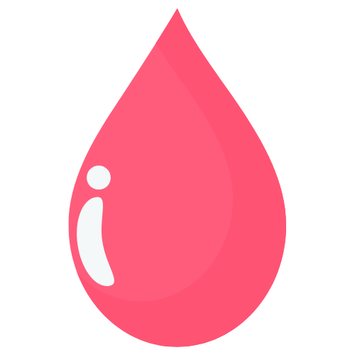

  
  <h1>PinkDays</h1>
  
<strong>Private, Lightweight Period Tracker</strong>

  

    
    
    
    
    
  

---

**PinkDays** is a beautiful, private, and lightweight period tracker that runs entirely on your device.

We prioritize your privacy above all else. Unlike other apps, PinkDays keeps your sensitive health data stored securely in your browser, with no unauthorized cloud uploads.

## 🚀 Why PinkDays?

| Feature | PinkDays | Flo / Clue |
| :--- | :--- | :--- |
| **Privacy** | 🔒 **Maximum** (On-Device) | ☁️ **Low** (Cloud/Data Sales) |
| **Cost** | 💸 **Free** (Forever) | 💳 **Subscription** (Premium) |
| **Ads** | 🚫 **None** (Clean UI) | 📢 **Frequent** |
| **Data Control** | 💾 **Full** (Export/Import) | 🔒 **Locked** (Hard to leave) |

## ✨ Key Features

*   **Smart Predictions**: 📈 Accurately forecasts your next period and fertile window.
*   **Interactive Calendar**: 🗓️ Log flow intensity and view cycle history in a clean layout.
*   **Insightful Statistics**: 📊 Track average cycle length and duration patterns.
*   **Privacy-First**: 🔒 Data stays 100% on your device by default.
*   **Cloud Sync**: ☁️ Optional login to sync data across devices.
*   **Data Control**: 📥 Backup and restore your data with one click.

## 📦 Tech Stack
*   **HTML5**
*   **Tailwind CSS**
*   **JavaScript**
*   **Firebase** (Optional Sync)

## 📄 License
MIT License. Free for personal use.

---

  Made with ❤️ by <a href="mailto:arunthomas04042001@gmail.com">Arun Thomas</a>

